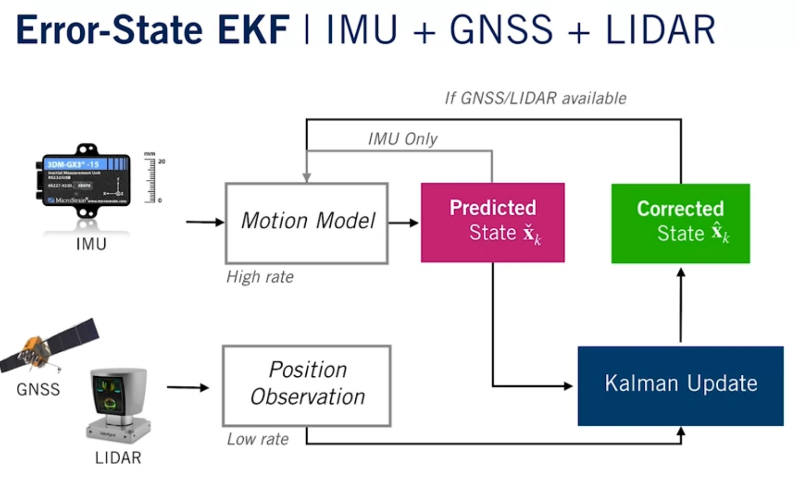
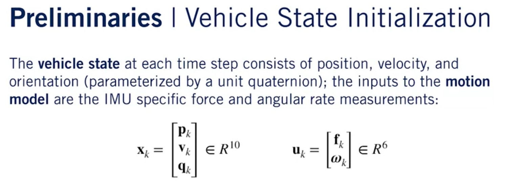
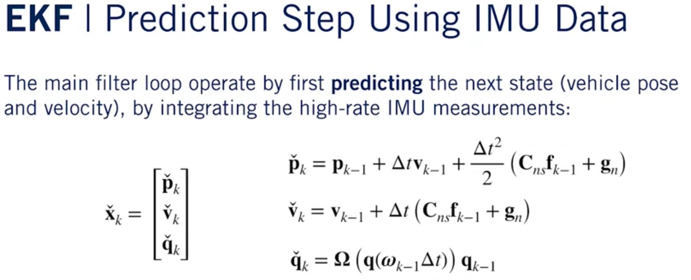
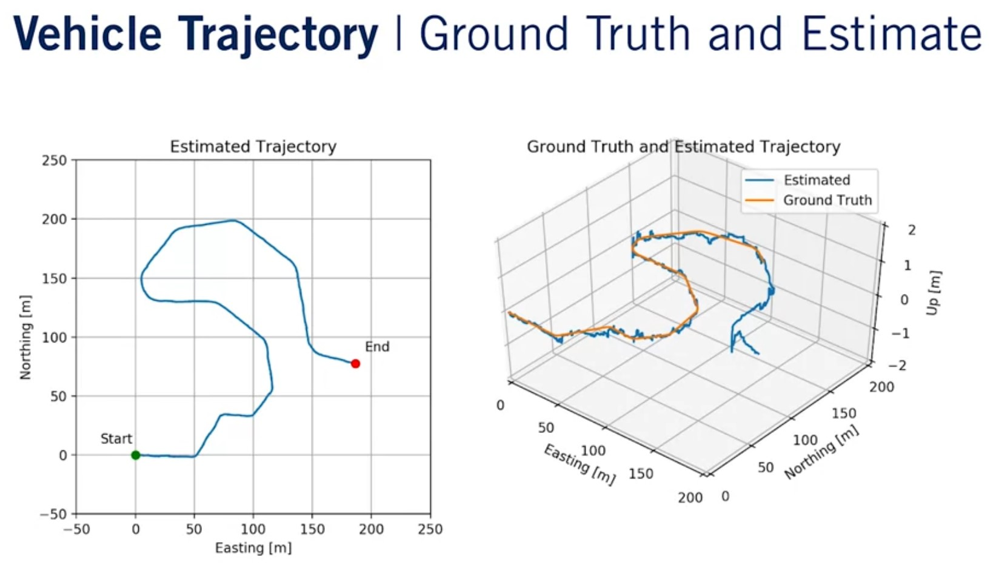
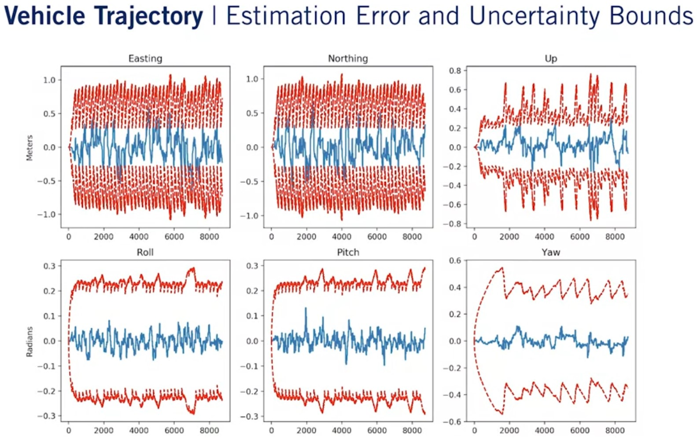

# Error-State-Extended-Kalman-Filter
Vehicle State Estimation using Error-State Extended Kalman Filter

 In this project, I implemented the Error-State Extended Kalman Filter (ES-EKF) to localize a vehicle using data from the CARLA simulator.

- The data set contains measurements from a sensor array on a moving self-driving car.
- The sensor array consists of an IMU, a GNSS receiver, and a LiDAR, all of which provide measurements of varying reliability and at different rates.

- Our goal is to implement a state estimator that fuses the available sensor measurements to provide a reasonable estimate of the vehicle's pose and velocity. Specifically, we will be implementing the Error-State Extended Kalman Filter.

- In the main filter loop, you will first update the state and the uncertainty using IMU readings.

- Whenever a GNSS or LiDAR measurement becomes available, you will execute the appropriate common gain computation, error state, and covariance updates.

- We will have access to the actual pose and velocity values from Carla for a large section of the trajectory. So you will be able to compare your trajectory estimates to the ground truth data.

## Solution Approach

# Running 

- To run es_ekf.py, simply call **python es_ekf.py** from the command line or 'run es_ekf.py' from within an interactive shell.

- As the code runs, some visualizations (plots) will already appear for you, including a plot of the ground truth trajectory, a plot of the ground truth trajectory compared to your estimated trajectory, and six error plots.

# Final Notes:
- This is a module assignment project from State Estimation and Localization course of **Self-Driving Cars Specialization by University of Toronto.**

- All of the data from Carla Simulator contained as the Python pickle (pkl) file inside the Data folder

- The data folder contains the data you will use for the project, and the rotations.py file contains a Quaternion class

